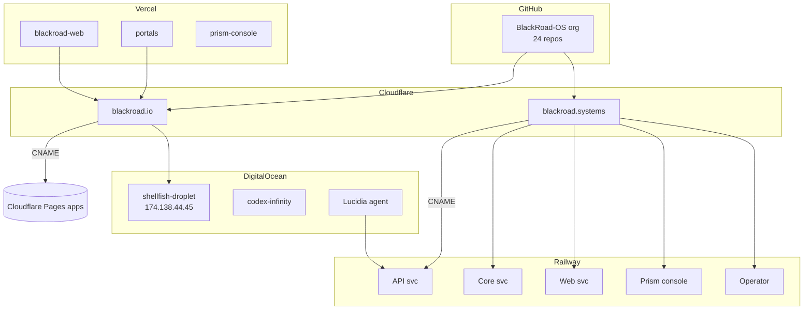

# 🧭 BlackRoad OS – Master Infrastructure Blueprint

_Last updated: 2025-11-24_  
_Scope: GitHub · Cloudflare · Railway · DigitalOcean · Vercel_

---

## 0. High-Level Mental Model

BlackRoad is already a **multi-cloud, multi-runtime OS**:

- **GitHub** → Source of truth for code, issues, teams, and orchestration (BlackRoad-OS org).
- **Cloudflare**  
  - `blackroad.io` → Edge + static / Pages services.  
  - `blackroad.systems` → Edge in front of Railway app backends.
- **Railway** → Production microservices (`*.up.railway.app`) behind `blackroad.systems`.
- **DigitalOcean**  
  - Droplets → raw compute / legacy / special services.  
  - DO Agents → managed AI agents (Lucidia, etc.).
- **Vercel** → Fast iteration and UX surfaces (web, console, portals, experiments).

Think of it as:

> _GitHub brain → Cloudflare edge → Railway & DO heart → Vercel face._

---

## 1. Identity & Organizations

### 1.1 GitHub Enterprise & Orgs

**Enterprise:** `BlackRoad OS, Inc.`  
**Enterprise orgs (connected view):**
- `BlackRoad-OS` (24 repos – core OS)

**Personal account:** `blackboxprogramming`

**Additional orgs you own (brand universe):**
- `Blackbox-Enterprises`
- `BlackRoad-AI`
- `BlackRoad-OS`
- `BlackRoad-Labs`
- `BlackRoad-Cloud`
- `BlackRoad-Ventures`
- `BlackRoad-Foundation`
- `BlackRoad-Media`
- `BlackRoad-Hardware`
- `BlackRoad-Education`
- `BlackRoad-Gov`
- `BlackRoad-Security`
- `BlackRoad-Interactive`
- `BlackRoad-Archive`
- `BlackRoad-Studio`

_Reality: `BlackRoad-OS` is the current “core OS” org; others are staged for future separation of concerns._

---

## 2. GitHub – Repos, Teams, Projects

### 2.1 Core Org: `BlackRoad-OS`

**Key stats:**
- Repos: **24**
- Teams: **13**
- Projects: **1** (BlackRoad OS – Master Orchestration)
- People: **1 (owner)**

#### 2.1.1 Repositories (by domain)

**OS & Core Services**
- `blackroad-os-core` – main OS app; desktop UI, backend APIs, auth, identity, state.
- `blackroad-os-api` – minimal API/operator-style service.
- `blackroad-os-operator` – jobs, schedulers, agent orchestration.
- `blackroad-os-api-gateway` – gateway / routing layer (API front-door).
- `blackroad-os-web` – public website / web surface.
- `blackroad` – meta / umbrella repo for the ecosystem.

**Infra / Admin**
- `blackroad-os-infra` – infra-as-code, DNS, Cloudflare, Railway, deployment patterns.
- `blackroad-os-beacon` – beacon/status/health aggregation (append-only style).
- `blackroad-os-archive` – append-only logs, deploy history, beacon maps.

**Knowledge & Docs**
- `blackroad-os-docs` – OS + Lucidia + QLM + agents documentation.
- `blackroad-os-research` – SIG, PS-SHA∞, math/theory codex.
- `blackroad-os-home` – company handbook, governance, ops.
- `blackroad-os-ideas` – central idea/experiment backlog.
- `blackroad-os-demo` – showcase repo.

**Domain Packs**
- `blackroad-os-pack-creator-studio`
- `blackroad-os-pack-education`
- `blackroad-os-pack-infra-devops`
- `blackroad-os-pack-legal`
- `blackroad-os-pack-finance`
- `blackroad-os-pack-research-lab`

**Agents**
- `blackroad-os-agents` – agent definitions/orchestration scaffolding.

#### 2.1.2 Teams (GitHub Teams)

Each team is mapped to one or more repos:

- `blackroad-core`
- `blackroad-api`
- `blackroad-operator`
- `blackroad-prism-console`
- `blackroad-web`
- `blackroad-infra`
- `blackroad-docs`
- `blackroad-research`
- `blackroad-brand`
- `blackroad-home`
- `blackroad-ideas`
- `blackroad-demo`
- `blackroad-archive`

_All currently have you as the single member; logically ready for agent/people expansion._

#### 2.1.3 Projects

- **Project:** `BlackRoad OS – Master Orchestration` (Project #2)
  - Type: GitHub Projects (table/board)
  - Role: central coordination across `blackroad-os-*` repos.
  - Custom fields:
    - `Team` (Core, Web, API, Operator, Prism Console, Infra, Docs, Research, Archive, Brand, Packs, etc.)
  - Views:
    - “All Work” – grouped by Team.
    - Per-Team views – filtered on the `Team` field.

---

## 3. Domains & DNS (Cloudflare)

### 3.1 Zones (Account: `amundsonalexa@gmail.com`)

Active domains in Cloudflare (16):

- `blackroad.io`
- `blackroad.me`
- `blackroad.network`
- `blackroadai.com`
- `blackroadinc.us`
- `blackroadqi.com`
- `blackroadquantum.com`
- `blackroadquantum.info`
- `blackroadquantum.net`
- `blackroadquantum.shop`
- `blackroadquantum.store`
- `blackroad.systems`
- `lucidia.earth`
- `lucidiaqi.com`
- `lucidia.studio`
- `aliceqi.com`

Below we detail the two primary “OS” zones:

---

### 3.2 `blackroad.io` (Pages-fronted / static & UI layer)

**Root A records**
- `blackroad.io` → `174.138.44.45` (DO droplet `shellfish-droplet`, proxied)
- `www.blackroad.io` → `174.138.44.45` (proxied)

**CNAME → Cloudflare Pages mappings**

| Subdomain | Target                          | Purpose / Repo                    |
|----------|----------------------------------|-----------------------------------|
| `api`    | `blackroad-os-api.pages.dev`     | API surface (CF Pages) – `blackroad-os-api` |
| `brand`  | `blackroad-os-brand.pages.dev`   | Brand system – `blackroad-os-brand` |
| `chat`   | `nextjs-ai-chatbot.pages.dev`    | Chatbot UI – `nextjs-ai-chatbot` (Vercel/Cf hybrid) |
| `console`| `blackroad-os-prism-console.pages.dev` | Prism console – `blackroad-os-prism-console` |
| `core`   | `blackroad-os-core.pages.dev`    | OS core UI/API – `blackroad-os-core` |
| `dashboard` | `blackroad-os-operator.pages.dev` | Ops/Operator dashboard – `blackroad-os-operator` |
| `demo`   | `blackroad-os-demo.pages.dev`    | Demo/showcase – `blackroad-os-demo` |
| `docs`   | `blackroad-os-docs.pages.dev`    | Docs – `blackroad-os-docs` |
| `ideas`  | `blackroad-os-ideas.pages.dev`   | Ideas backlog – `blackroad-os-ideas` |
| `infra`  | `blackroad-os-infra.pages.dev`   | Infra docs/portal – `blackroad-os-infra` |
| `operator` | `blackroad-os-operator.pages.dev` | Operator surface – `blackroad-os-operator` |
| `prism`  | `blackroad-os-prism-console.pages.dev` | Prism console – `blackroad-os-prism-console` |
| `research` | `blackroad-os-research.pages.dev` | Research portal – `blackroad-os-research` |
| `studio` | `lucidia.studio.pages.dev`       | Lucidia Studio front – `lucidia.studio` |
| `web`    | `blackroad-os-web.pages.dev`     | Main marketing web – `blackroad-os-web` |

_All of the above are **proxied** through Cloudflare._

**TXT & verification**
- Multiple `openai-domain-verification` tokens.
- `atlassian-domain-verification=...`
- `hubspot-developer-verification=...`
- `_gh-blackroad-os-o` → GitHub verification token.

---

### 3.3 `blackroad.systems` (Railway-backed / service layer)

This zone fronts your Railway apps and mail config.

**CNAME → Railway mappings**

| Subdomain   | Target (Railway)                                    | Likely Repo / Role                          |
|------------|------------------------------------------------------|---------------------------------------------|
| `blackroad.systems` (apex) | `jwb6j4o5.up.railway.app`                    | Main OS shell / router                      |
| `www`      | `blackroad.systems`                                 | Alias                                       |
| `os`       | `blackroad.systems`                                 | OS alias                                    |
| `api`      | `blackroad-os-api-production-ff5a.up.railway.app`   | `blackroad-os-api`                          |
| `app`      | `qj64zcxg.up.railway.app`                           | App entry (TBD – possibly Lucidia/portal)   |
| `brand`    | `blackroad-os-brand-production.up.railway.app`      | `blackroad-os-brand`                        |
| `console`  | `blackroad-os-prism-console-production-3118.up.railway.app` | `blackroad-os-prism-console`      |
| `core`     | `blackroad-os-core-production.up.railway.app`       | `blackroad-os-core`                         |
| `docs`     | `blackroad-os-docs-production-d8de.up.railway.app`  | `blackroad-os-docs`                         |
| `ideas`    | `blackroad-os-ideas-production.up.railway.app`      | `blackroad-os-ideas`                        |
| `infra`    | `blackroad-os-infra-production.up.railway.app`      | `blackroad-os-infra`                        |
| `operator` | `blackroad-os-operator-production-021e.up.railway.app` | `blackroad-os-operator`                 |
| `prism`    | `blackroad-prism-console-production.up.railway.app` | `blackroad-os-prism-console`                |
| `research` | `blackroad-os-research-production.up.railway.app`   | `blackroad-os-research`                     |
| `router`   | `h7o1fsvl.up.railway.app`                           | Router/gateway (TBD)                        |
| `web`      | `blackroad-os-web-production-a2ee.up.railway.app`   | `blackroad-os-web`                          |

_All proxied via Cloudflare._

**Mail & auth**
- `MX` – `route1/2/3.mx.cloudflare.net`
- `TXT` – SPF: `v=spf1 include:_spf.mx.cloudflare.net ~all`
- `TXT` – DKIM (`cf2024-1._domainkey`)
- `TXT` – `dmarc` policy: `p=quarantine; ...`
- `TXT` – `_gh-blackroad-os-o` + `_github-pages-challenge-blackroad-os`

---

## 4. Runtime Surfaces

### 4.1 Cloudflare Pages – OS Surfaces

From the Workers & Pages view:

Pages apps (examples):

- `blackroad-os-prism` → `blackroad-os-prism.pages.dev`
- `blackroad-os-operator` → `blackroad-os-operator.pages.dev`
- `blackroad-os-api` → `blackroad-os-api.pages.dev`
- `blackroad-os-infra` → `blackroad-os-infra.pages.dev`
- `blackroad-os-docs` → `blackroad-os-docs.pages.dev`
- `blackroad-os-core` → `blackroad-os-core.pages.dev`
- `blackroad-os-brand` → `blackroad-os-brand.pages.dev`
- `blackroad-os-web` → `blackroad-os-web.pages.dev`
- `blackroad-os-ideas` → `blackroad-os-ideas.pages.dev`
- `blackroad-os-research` → `blackroad-os-research.pages.dev`

These align with the `blackroad.io` CNAME layer (section 3.2).

---

### 4.2 Railway – Production Apps

Railway apps (inferred from CNAMEs) back `blackroad.systems`:

- `blackroad-os-api-production-ff5a.up.railway.app`
- `blackroad-os-brand-production.up.railway.app`
- `blackroad-os-core-production.up.railway.app`
- `blackroad-os-docs-production-d8de.up.railway.app`
- `blackroad-os-ideas-production.up.railway.app`
- `blackroad-os-infra-production.up.railway.app`
- `blackroad-os-operator-production-021e.up.railway.app`
- `blackroad-prism-console-production.up.railway.app`
- `blackroad-os-research-production.up.railway.app`
- `blackroad-os-web-production-a2ee.up.railway.app`
- `jwb6j4o5.up.railway.app` (apex `blackroad.systems`)
- `qj64zcxg.up.railway.app` (`app.blackroad.systems`)
- `h7o1fsvl.up.railway.app` (`router.blackroad.systems`)

_These are the “real” production service processes._

---

### 4.3 DigitalOcean – Droplets & Agents

#### 4.3.1 Droplets

- `shellfish-droplet`
  - Region: NYC1
  - Spec: 1 GB / 1 vCPU / 25 GB
  - OS: CentOS 9 Stream
  - IP: `174.138.44.45`
  - Linked via A records for `blackroad.io` and `www.blackroad.io`.

- `codex-infinity`
  - Region: NYC3
  - Spec: 8 GB / 4 vCPU / 80 GB
  - OS: Ubuntu 22.04 LTS
  - IP: `159.65.43.12`
  - Likely heavy compute / LLM / agent infrastructure box.

#### 4.3.2 DigitalOcean Projects

- `first-project` (default)
  - Agents:
    - `Lucidia` → `https://hkfc4k7ftrrf4we6n627lkje.agents.do-ai.run`
    - `agent-09012025` → `https://o5lftkxyncshrl6srizy7eyw.agents.do-ai.run`
  - Droplet: `shellfish-droplet`
  - Domain: `blackroad.io` (DO’s DNS view, though Cloudflare is now primary).

- `BlackRoad.io` – (likely for future/alternate domain DNS or app resources).
- `BlackRoad` – general OS resources.
- `Lucidia` – dedicated project for Lucidia-related infra.

---

### 4.4 Vercel – Frontend & Prototyping

Team: **Alexa Amundson’s projects**

Projects:

- `blackroad-web`
  - URL: `https://blackroad-web.vercel.app/`
  - Repo: `github.com/blackboxprogramming/blackroad-prism-console` (linked integration; note: this project is deployed from the prism-console repo due to monorepo structure / legacy reasons. If you expect a dedicated repo, see maintainers for details.)
- `portals`
  - URL: `https://blackroad.io/` (Vercel project connected to apex domain)
  - Repo: `blackboxprogramming/blackroad-prism-console`
- `blackroad-prism-console`
  - URL: `https://blackroad-prism-console.vercel.app/`
  - Repo: `blackboxprogramming/blackroad-prism-console`
- `my-repository`
  - URL: `https://my-repository-ebon-nine.vercel.app/`
  - Repo: `blackboxprogramming/my-repository`
- `nextjs-ai-chatbot`
  - URL: `https://nextjs-ai-chatbot-gray-tau-ri18agfn7a.vercel.app/`
  - Repo: `blackboxprogramming/nextjs-ai-chatbot`
- `next-video-starter`
  - URL: `https://next-video-starter-liart.vercel.app/`
  - Repo: `blackboxprogramming/next-video-starter`

_Usage is near zero → this is a safe playground for frontends and variations without affecting prod._

---

## 5. Health / Status / Beacon Plan

To standardize observability across all the surfaces, adopt:

### 5.1 Standard Endpoints

For **every web-facing service** (Pages, Railway, DO, Vercel):

- `GET /health` → `{ status: "ok", service: "<name>", version: "<semver or git SHA>", timestamp: "<iso>" }`
- `GET /version` → `{ version: "<semver>", commit: "<full SHA>", buildTime: "<iso>" }`
- `GET /info` → optional extended metadata (env, region, dependencies).

### 5.2 Beacon Aggregator

Use `blackroad-os-beacon` + `blackroad-os-archive` to:

- Poll all known endpoints on a schedule.
- Write a map like `sig.beacon.json` with:
  - host
  - status
  - last_ok
  - response_time_ms
  - version
- Append results to `blackroad-os-archive` for long-term history.

---

## 6. Suggested Next Steps (Roadmap From This Blueprint)

1. **Create this file in GitHub**
   - Path: `blackroad-os-infra/docs/BLACKROAD_INFRA.md` or similar.
   - Make this the **canonical infra source-of-truth**.

2. **Add a `SERVICES_REGISTRY.yaml` or `.json`**
   - Machine-friendly mapping of:
     - `service_id`
     - `domain` + `path`
     - `repo`
     - `runtime` (`pages`, `railway`, `droplet`, `vercel`)
     - `team`
     - `health_url`

3. **Normalize Health Endpoints**
   - Sweep each Railway app & Pages app.
   - Add `/health` & `/version` if missing.
   - Document them here.

4. **Tighten DNS Naming**
   - Decide a convention:
     - `*.blackroad.io` → public/marketing/UI surfaces.
     - `*.blackroad.systems` → internal/ops/API surfaces.
   - Move anything inconsistent into the right bucket.

5. **Tag Projects & Resources**
   - In DO, CF, and Vercel, add tags/notes:
     - `env:prod|staging|dev`
     - `owner:blackroad-os-core`
     - `criticality:high|medium|low`

6. **Create Architecture Diagram**
   - Use this blueprint to render a Mermaid or Figma diagram.
   - Store as `docs/BLACKROAD_ARCHITECTURE.md`.

---

## 7. Quick Mermaid Sketch (Optional)

⸻

End of Master Infrastructure Blueprint

If you want, next step I can do is break out a **machine-readable `services_registry.json`** from this same blueprint so Lucidia/Atlas/whatever-agent can auto-reason over the infra.
