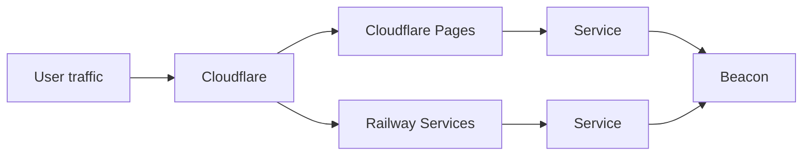

# BlackRoad OS Infra Overview

This repository is the single source of truth for DNS blueprints, Railway service templates, and SIG health specifications. Individual app repositories own implementation details, but all shared infrastructure policy and routing intent lives here.

## Scope

- **In this repo**: Cloudflare DNS blueprints (`cloudflare/`), Railway templates (`railway/`), SIG schemas and examples (`sig/`, `docs/examples/`), and validation scripts (`scripts/`).
- **In app repos**: Application code, Dockerfiles or Nixpacks definitions, and service-specific configuration values (secrets remain in platform vaults).

## Infra personas

- **Infra Steward** – curates DNS routes, keeps Railway templates aligned with platform standards, and publishes SIG schemas and samples.
- **Deploy Conductor** – coordinates releases across services using the templates and deploy logs to verify parity across environments.
- **Policy Steward** – reviews and signs off on infra-impacting changes, especially around DNS routing, beacon headers, and deploy logging.

## Request flow

Cloudflare proxies both Pages-backed and Railway-backed services. Each service publishes a beacon consumed by the operator for centralized health and deploy visibility.
