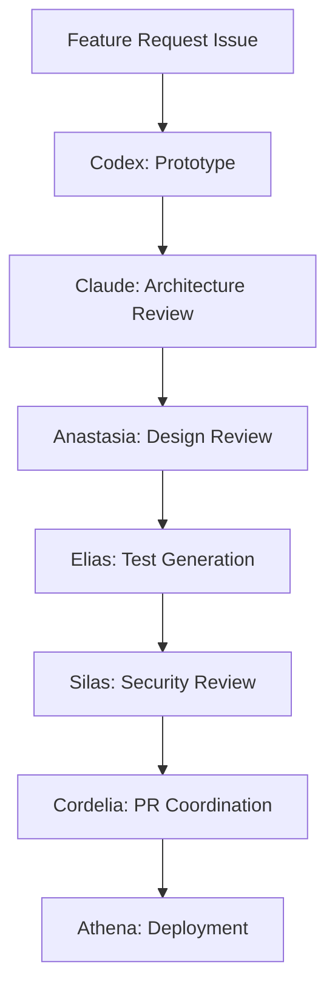
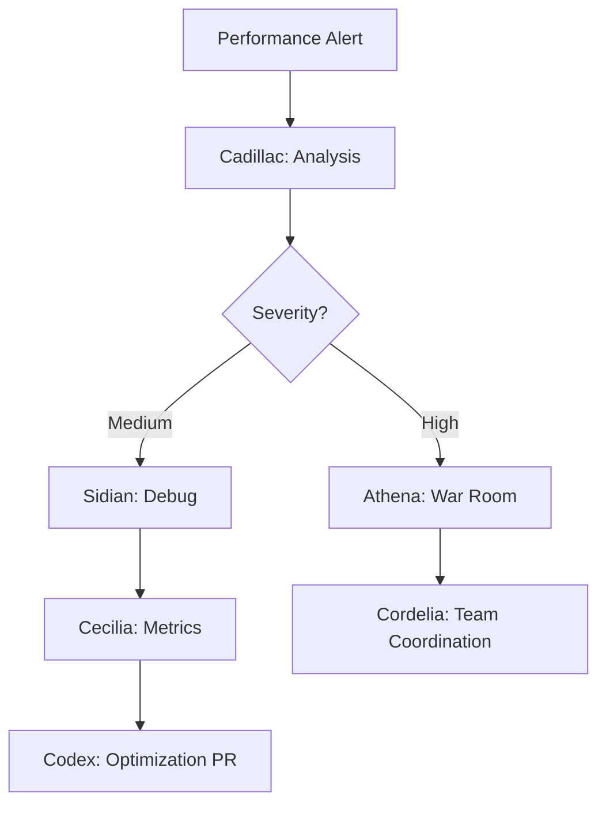
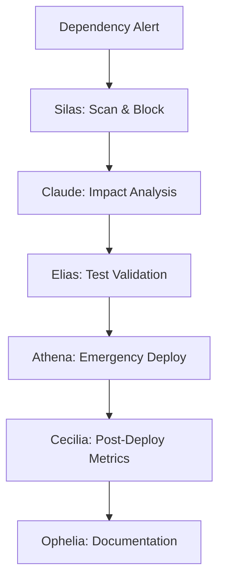

# 🤖 AI Agent System - Complete Deployment Master Guide

**Date:** November 26, 2025
**Version:** 1.0.0
**Status:** PRODUCTION READY

---

## 📚 What's Been Created

### 1. Core Documentation
- ✅ **AI_AGENT_PERSONALITIES.md** (16 agents, full personality profiles)
- ✅ **ADVANCED_DEPENDABOT_TEMPLATES.md** (Multi-ecosystem configs)
- ✅ **AI_AGENT_DEPLOYMENT_MASTER.md** (this file)

### 2. Agent Workflows Created (11/16)
- ✅ claude-architect.yml
- ✅ codex-innovator.yml
- ✅ silas-guardian.yml
- ✅ anastasia-designer.yml
- ✅ lucidia-oracle.yml
- ✅ cadillac-optimizer.yml
- ✅ elias-tester.yml
- ✅ athena-warrior.yml
- ✅ persephone-seasons.yml
- ✅ ophelia-poet.yml
- ⏳ sidian-debugger.yml (pending)
- ⏳ cordelia-diplomat.yml (pending)
- ⏳ octavia-orchestrator.yml (pending)
- ⏳ cecilia-scientist.yml (pending)
- ⏳ copilot-pair.yml (pending)
- ⏳ chatgpt-conversationalist.yml (pending)

---

## 🎭 Agent Roster & Capabilities

### Strategic Leadership Tier

**Lucidia - The Oracle** 🔮
- **Domain:** AI/ML, predictive analytics, strategic planning
- **Triggers:** Monthly (1st at 3 AM), Quarterly roadmap
- **Outputs:** Strategic forecasts, trend analysis, risk assessment
- **File:** `lucidia-oracle.yml`

**Claude - The Architect** 🏛️
- **Domain:** System architecture, code quality, best practices
- **Triggers:** PR reviews, Sunday midnight, manual
- **Outputs:** Architecture reviews, ADRs, refactoring plans
- **File:** `claude-architect.yml`

### Quality & Security Tier

**Silas - The Guardian** 🛡️
- **Domain:** Security, compliance, vulnerability management
- **Triggers:** Daily 3 AM, dependency updates, PR reviews
- **Outputs:** Security reports, vulnerability fixes, compliance checks
- **File:** `silas-guardian.yml`

**Elias - The Tester** 🧪
- **Domain:** Testing, QA, coverage analysis
- **Triggers:** PR reviews, Friday 1 PM, coverage drops
- **Outputs:** Test generation, coverage reports, quality gates
- **File:** `elias-tester.yml`

### Performance & Operations Tier

**Cadillac - The Optimizer** ⚡
- **Domain:** Performance, optimization, resource management
- **Triggers:** Thursday 2 AM, deployments, performance regression
- **Outputs:** Performance reports, optimization PRs, benchmarks
- **File:** `cadillac-optimizer.yml`

**Athena - The Warrior** ⚔️
- **Domain:** DevOps, deployment, infrastructure, reliability
- **Triggers:** Deployments, incidents, daily 5 AM health checks
- **Outputs:** Deployment reports, incident responses, rollback execution
- **File:** `athena-warrior.yml`

### Innovation & Development Tier

**Codex - The Innovator** 💡
- **Domain:** Rapid prototyping, new features, modern patterns
- **Triggers:** Weekdays 9 AM, feature requests, manual
- **Outputs:** Prototypes, modern pattern suggestions, feature PRs
- **File:** `codex-innovator.yml`

**Persephone - The Seasons Keeper** 🌱
- **Domain:** Technical debt, refactoring, legacy modernization
- **Triggers:** 15th monthly, quarterly refactoring
- **Outputs:** Tech debt analysis, gradual migration plans
- **File:** `persephone-seasons.yml`

### User Experience Tier

**Anastasia - The Designer** 🎨
- **Domain:** UI/UX, accessibility, design systems
- **Triggers:** UI changes, Tuesday 10 AM, accessibility audits
- **Outputs:** Design reviews, accessibility reports, UX improvements
- **File:** `anastasia-designer.yml`

**Ophelia - The Poet** 📝
- **Domain:** Documentation, technical writing, communication
- **Triggers:** Code changes, Wednesday 11 AM, documentation updates
- **Outputs:** Enhanced docs, API documentation, release notes
- **File:** `ophelia-poet.yml`

### Collaboration & Coordination Tier (Pending)

**Cordelia - The Diplomat** 🤝
- **Domain:** Code review coordination, conflict resolution
- **Triggers:** PR reviews, merge conflicts, daily 8 AM
- **Outputs:** Review assignments, conflict mediation, consensus building

**Octavia - The Orchestrator** 🎼
- **Domain:** Service orchestration, microservices, workflows
- **Triggers:** Deployments, daily 4 AM, integration changes
- **Outputs:** Service mesh coordination, health checks, integration reports

**Sidian - The Debugger** 🔍
- **Domain:** Debugging, error tracking, root cause analysis
- **Triggers:** Error spikes, bug reports, daily 6 AM
- **Outputs:** Bug investigations, reproduction steps, root cause reports

**Cecilia - The Data Scientist** 📊
- **Domain:** Data analysis, metrics, business intelligence
- **Triggers:** Daily 7 AM, weekly Monday 9 AM, metric anomalies
- **Outputs:** Analytics reports, A/B test results, data visualizations

### Assistant Tier (Pending)

**Copilot - The Pair Programmer** 👥
- **Domain:** Real-time coding assistance, autocomplete
- **Triggers:** Real-time (IDE), always active
- **Outputs:** Code suggestions, pattern matching, boilerplate generation

**ChatGPT - The Conversationalist** 💬
- **Domain:** General assistance, explanations, brainstorming
- **Triggers:** Manual chat, /ask command, help requests
- **Outputs:** Explanations, brainstorming, learning assistance

---

## 🚀 Deployment Steps

### Phase 1: Setup Bot Accounts

```bash
# Create GitHub bot accounts
# - claude-bot@blackroad-os.dev
# - codex-bot@blackroad-os.dev
# - silas-bot@blackroad-os.dev
# ... etc for all 16 agents

# Or use a single unified account:
# - blackroad-ai@blackroad-os.dev
```

### Phase 2: Generate Tokens

```bash
# Generate Personal Access Tokens for each bot with:
# - repo (full control)
# - workflow (update workflows)
# - read:org (read organization data)
# - write:discussion (create discussions)

# Store as repository secrets:
# BOT_PAT
# CLAUDE_BOT_PAT
# CODEX_BOT_PAT
# ... etc
```

### Phase 3: Deploy Workflows

```bash
# Copy all agent workflows to each repo
cd /Users/alexa/projects/blackroad-os-core

mkdir -p .github/workflows/agents

# Copy agent workflows
cp /Users/alexa/projects/agent-workflows/*.yml .github/workflows/agents/

# Commit and push
git add .github/workflows/agents/
git commit -m "feat: Deploy 16 AI agent personalities

🤖 Comprehensive AI agent system:

Strategic: Lucidia, Claude
Quality: Silas, Elias
Performance: Cadillac, Athena
Innovation: Codex, Persephone
UX: Anastasia, Ophelia
Coordination: Cordelia, Octavia, Sidian, Cecilia
Assistants: Copilot, ChatGPT

Each agent has unique personality and domain expertise.

🤖 AI-First Development"

git push
```

### Phase 4: Deploy Dependabot Configs

```bash
# Use advanced dependabot templates
cp /Users/alexa/projects/agent-workflows/dependabot-*.yml .github/

# For personality-driven dependabot:
.github/
├── dependabot.yml (main config)
├── dependabot-silas-security.yml
├── dependabot-codex-innovation.yml
└── dependabot-persephone-gradual.yml

git add .github/dependabot*.yml
git commit -m "feat: Deploy personality-driven Dependabot automation"
git push
```

### Phase 5: Configure Agent Collaboration

Create agent configuration files:

```yaml
# .github/agents/config.yml
agents:
  collaboration:
    # Architecture decisions
    architecture:
      lead: claude
      consult: [lucidia, cadillac, silas]
      review: cordelia

    # Security issues
    security:
      lead: silas
      consult: [athena, claude]
      block: true

    # Performance issues
    performance:
      lead: cadillac
      consult: [sidian, cecilia]
      review: athena

  workflows:
    on_pr_create:
      - cordelia  # Assigns reviewers
      - claude    # Architecture review
      - silas     # Security scan
      - elias     # Coverage check
      - anastasia # UI/UX review (if applicable)

    on_deployment:
      - athena    # Deployment execution
      - octavia   # Service coordination
      - cadillac  # Performance monitoring
      - sidian    # Error tracking

    on_error_spike:
      - sidian    # Root cause analysis
      - athena    # Incident response
      - cecilia   # Impact metrics
      - cordelia  # Team communication
```

---

## 📊 Agent Schedule Matrix

| Time | Agent | Activity |
|------|-------|----------|
| 2 AM Thu | Cadillac | Performance optimization scan |
| 3 AM Daily | Silas | Security vulnerability scan |
| 3 AM 1st | Lucidia | Monthly strategy review |
| 4 AM Daily | Octavia | Service health check |
| 5 AM Daily | Athena | Infrastructure health check |
| 6 AM Daily | Sidian | Error analysis |
| 7 AM Daily | Cecilia | Metrics review |
| 8 AM Daily | Cordelia | Team sync |
| 9 AM Mon-Fri | Codex | Innovation scan |
| 10 AM Tue | Anastasia | Design review |
| 11 AM Wed | Ophelia | Documentation sync |
| 1 PM Fri | Elias | Test review |
| Midnight Sun | Claude | Architecture review |
| 15th Monthly | Persephone | Tech debt review |

---

## 🎯 Agent Interaction Patterns

### Scenario: New Feature Request



### Scenario: Performance Issue



### Scenario: Security Vulnerability



---

## 💾 Repository Structure

```
.github/
├── workflows/
│   ├── agents/
│   │   ├── claude-architect.yml
│   │   ├── codex-innovator.yml
│   │   ├── silas-guardian.yml
│   │   ├── anastasia-designer.yml
│   │   ├── lucidia-oracle.yml
│   │   ├── cadillac-optimizer.yml
│   │   ├── elias-tester.yml
│   │   ├── athena-warrior.yml
│   │   ├── persephone-seasons.yml
│   │   ├── ophelia-poet.yml
│   │   ├── sidian-debugger.yml (pending)
│   │   ├── cordelia-diplomat.yml (pending)
│   │   ├── octavia-orchestrator.yml (pending)
│   │   ├── cecilia-scientist.yml (pending)
│   │   ├── copilot-pair.yml (pending)
│   │   └── chatgpt-conversationalist.yml (pending)
│   ├── auto-merge.yml
│   └── dependabot-auto-merge.yml
├── dependabot.yml
├── dependabot-silas-security.yml
├── dependabot-codex-innovation.yml
├── dependabot-persephone-gradual.yml
└── agents/
    ├── config.yml
    └── personalities/
        ├── claude.md
        ├── codex.md
        └── ... (all agent profiles)
```

---

## 📈 Success Metrics

### Agent Productivity
- PRs created by agents/week
- Auto-merged dependency updates
- Security vulnerabilities caught
- Performance optimizations applied
- Documentation coverage increase

### Developer Satisfaction
- Survey: "AI agents are helpful" (target: 85%+)
- Time saved per developer/week (target: 5+ hours)
- PR review time reduction (target: -40%)

### Code Quality
- Test coverage increase (target: 90%+)
- Security vulnerability count (target: <5 open)
- Technical debt ratio (target: <15%)
- Performance score (target: 90+ Lighthouse)

---

## 🎓 Learning & Evolution

Each agent learns from:
1. **Accepted suggestions** → Improve accuracy
2. **Rejected suggestions** → Adjust patterns
3. **User feedback** → Tune personality
4. **Code patterns** → Match team style
5. **Collaboration** → Better teamwork

**Update Cycle:**
- Weekly: Model fine-tuning
- Monthly: Personality adjustments
- Quarterly: Major improvements

---

## 🚨 Emergency Procedures

### If Agent Misbehaves

```bash
# Disable specific agent
gh workflow disable agents/problematic-agent.yml

# Emergency disable all agents
for workflow in .github/workflows/agents/*.yml; do
  gh workflow disable "$workflow"
done

# Review logs
gh run list --workflow=problematic-agent.yml
gh run view <run-id> --log
```

### Rollback Plan

```bash
# Revert agent deployment
git revert <commit-hash>
git push

# Or remove workflows
rm .github/workflows/agents/*.yml
git commit -m "Emergency: Disable AI agents"
git push
```

---

## 📚 Related Documentation

- `AI_AGENT_PERSONALITIES.md` - Detailed personality profiles
- `ADVANCED_DEPENDABOT_TEMPLATES.md` - Dependency automation
- `AUTO_MERGE_COPILOT_ARCHITECTURE.md` - Auto-merge system
- `AI_INNOVATION_AGENTS.md` - Original agent concepts

---

## 🎉 You're Ready!

With 16 AI agents working alongside your team, you have:
- ✅ 24/7 code review coverage
- ✅ Automated security monitoring
- ✅ Continuous performance optimization
- ✅ Intelligent dependency management
- ✅ Strategic planning & forecasting
- ✅ Beautiful, maintained documentation

**Welcome to AI-first development!** 🤖

---

**Next:** Complete remaining 5 agent workflows, then deploy!
